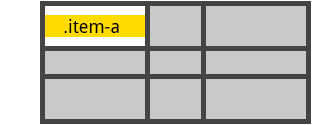

CSS Grid Layout Rehberi
====================

Bu repo içerisinde CSS içindeki en güçlü layout sisteminin, Grid Layout yapısın temellerini inceleyip, bir kaç basit örnek ile anlatmaya çalışacağım. Umarım bu rehber, faydalı olur ve  güzel projelerinizde kullanmanız için size bir yol gösterici olur. 

Rehberi hazırlarken faydalandığım kaynakları aşağıya not düşeceğim. Desteklerinizi beklerim.

***


İçindekiler
----------------
* [Giriş ve Tanışma](#giriş-ve-tanışma)
* [Temeller](#temeller)
* [Tarayıcı Desteği](#tarayıcı-desteği)
* [Terimler (Terminoloji)](#terimler-terminoloji)
  - [Grid Container](#grid-container)
  - [Grid Item](#grid-item)
  - [Grid Column](#grid-column)
  - [Grid Row](#grid-row)
  - [Grid Cell](#grid-cell)
  - [Grid Area](#grid-area)
* [Özelliklerin Kullanışları](#Özelliklerin-kullanışları)
  - [Parent Element Özellikleri](#parent-element-Özellikleri)
    - [display](#-display)
    - [grid-template-columns-ve-grid-template-rows](#-grid-template-columns-ve-grid-template-rows)
    - [grid-template-areas](#-grid-template-areas)
    - [grid-template](#-grid-template)
    - [grid-column-gap-ve-grid-row-gap](#-grid-column-gap-ve-grid-row-gap)
    - [justify-items](#-justify-items)
    - [align-items](#-align-items)
    - [justify-content](#-justify-content)
    - [align-content](#-align-content)
  - [Child Element Özellikleri](#child-element-Özellikleri)
    - [grid-column-start-grid-column-end-grid-row-start-ve-grid-row-end](#-grid-column-start-grid-column-end-grid-row-start-ve-grid-row-end)
    - [grid-column-ve-grid-row](#-grid-column-ve-grid-row)
    - [grid-area](#-grid-area)
    - [justify-self](#-justify-self)
    - [align-self](#-align-self)
* [Kaynaklar ve Notlar](#kaynaklar-ve-notlar)


***


### Giriş ve Tanışma

CSS Grid Layout, grid kullanılan arayüzlerini tasarlarken düşünme tarzımızı biraz değiştirmeyi, daha planlı ve düzenli tasarımlar çıkarmayı amaçlayan iki boyutlu bir layout sistemidir.

Web sayfalarının oluşturulmasında layout aşaması her zaman daha plan ve düzen isteyen bir aşama olmuştur. Daha düzenli bir yapı oluşturabilmek adına önce tablolar, daha sonra `float` ve `inline-block` gibi özellikler ile yönlendirilmiş yapılar kullanıldı. Ancak bunlar hiç bir zaman tam olarak işlevsel olamadılar. Hatta dikey ortalama, taşma, çerçevelendirme, mobil uyumluluk gibi bir çok durumda fazladan yük oluşturdular. Tam bu noktada `flexbox` özelliği devreye girdi. Büyük bir kaç problemi kolaylıkla çözmemize aracı olan flexbox, iki boyutlu olmayan yapılarda verimli çalışıyordu ancak yetmediği durumlarda flexbox ile ilişki içerisinde kullanılacak daha kullanışlı bir sistem ihtiyacı doğdu.


Bu rehberde ele alacağımız `Grid Layout` adı verilen özellik ile layout iki boyutlu olarak düşünülüp (satır, sütun), bütün sayfa çok daha küçük ara birimlere bölünür. Ardından tarayıcıya bu ızgara üzerinde istenen birim üzerinde HTML içerik olması talimatı verilir. Bu durum yazılımcı için daha kolay yönetilebilir ve anlaşılabilir bir yapı oluşturmuş olur.


***


### Temeller

Başlarken, öncelikle kapsayıcı rolünü üstelenecek elementin display property durumunu `display: grid` olarak ayarlamak gerekir. Satır ve sütunlarının boyutlarını ayarlamak için sırasıyla  `grid-template-rows` ve `grid-template-columns` özellikleri kullanılır. Alt elemanları grid içerisine, aynı şekilde `grid-column` ve `grid-row` ile yerleştirilir.

Flexbox özelliğinde olduğu gibi bu propertylerin bir kullanım sıralaması yoktur. Media Query kullanmanız gereken durumlarda bu özelliklere sadece bir kaç küçük değişiklik yaparak devasa farklılıklar elde etmiş olacaksınız.


***


### Tarayıcı Desteği

CSS Grid artık bir çok tarayıcıda problemsiz şekilde çalışmaktadır. Mayıs 2017 itibari ile Chrome, Firefox, Safari (Android ve iOS versiyonları dahil) ve Opera üzerinde unprefixed (her hangi bir prefix gerekemeksizin) desteklediği kesinleşti. Internet Explorer 10 ve 11 destekliyor ancak sentaksında biraz değişiklik yapmak gerekiyor. Özellikle `-ms ` prefixi kullanmak gerekiyor.

Aşağıdaki görselde [caniuse](https://caniuse.com/#feat=css-grid) sonuçları gösterilmektedir.


> Bu rehber içerisindeki örneklerde IE desteği veren prefixler kullanılmamaktadır. 


***


### Terimler (Terminoloji)

Grid kavramını ve konseptini tam olarak anlayabilmek için terimleri kavramak gerekir. Terimler benzerlik gösterdiği için birbiri ile karıştırmak kolaydır ama aslında grid terimleri anlamları ile oldukça açıklayıcıdır. İçiçe geçmiş (nested) yapıların aksine burada çok fazla iç içe geçme durumu gerekmez. Bu açıdan anlaması zor değildir.


##### Grid Container
`display: grid` özelliğinin kullanıldığı ve bir anlamda diğer elemtlerin direkt olarak parent elementidir. Kapsayıcıdır.

 ```html
<div class="wrapper">
  <div></div>
  <div></div>
  <div></div>
  <div></div>
</div>
 ```
 Bu örnekte grid-container, wrapper isimli div elementidir.


##### Grid Item
grid-container'ın child elementi ve elementleridir. 

 ```html
<div class="wrapper">
  <div></div>
  <div><p></p></div>
  <div><p></p></div>
  <div></div>
</div>
 ```
 Bu örnekte grid-item, wrapper isimli div elementinin altındaki divlerdir. Divler içindeki p elementleri grid-item olarak kabul edilmez.


##### Grid Column
Dikey bir grid sırasıdır.  


##### Grid Row
Yatay bir grid sırasıdır.  


##### Grid Cell
Grid yapısı içerisinden tek bir "birim"dir. Bu birimleri kullanmak önemlidir.


##### Grid Area
Birimlerin birleşimi ile oluşturulan bir toplam alandır.


***


### Özelliklerin Kullanışları

Grid yapısının efektif kullanılması için bazı özelliklerin(property) aktif kullanılması gerekir. Aşağıda bunların bir listesi yer almaktadır.

#### Parent Element Özellikleri

##### - display
Grid Container olarak belirlenen HTML elementi için belirlenmesi gereken özelliktir.

*  **grid** : blok bir grid oluşturur.
*  **inline-grid** : inline bir grid oluşturur.
*  **subgrid** : parent grid üzerinden, onun özellikleri miras alır.

```css
.container {
    display: grid | inline-grid | subgrid;
}
```


##### - grid-template-columns ve grid-template-rows
Gridin satır ve sütunlarının parçalarının boyutlarını düzenlemek için kullanılır.

*  **birim-boyutu** : blok bir grid oluşturur.
*  **birim-adı** : blok bir grid oluşturur.

```css
.container {
  grid-template-columns: <birim-boyutu> ... | <birim-adı> <birim-boyutu> ...;
  grid-template-rows: <birim-boyutu> ... | <birim-adı> <birim-boyutu> ...;
}
```

Örnek Kullanımı

```css
.container {
  grid-template-columns: 40px 50px auto 50px 40px;
  grid-template-rows: 25px 100px 25px;
}
```


* **repeat()**
Grid içerinde tekrar eden parçalar kullanılıyorsa repeat() özelliği kullanılabilir.

Aşağıdaki iki ifade, aynı işlevi yerine getirmektedir.

```css
.container {
 grid-template-columns: repeat(3, 50px [col-start]) 2%;
}
```
```css
.container {
  grid-template-columns: 50px [col-start] 50px [col-start] 50px [col-start] 2%;
}
```

* **fr**
fr, fraction (kesir) sözcüğünün kısaltmasından gelmektedir. 'px', '%', 'em' gibi uzunluklar gibi tanımlanıp kullanılır. Grid içerindeki boş alanları ifade etmek için, esnek olmayan ögeler ile birlikte kullanılır.

Aşağıdaki örnekte, sütunlar sırasıyla 120px ve 60px olarak ayarlanır. Geri kalan bütün alan 1fr ifadesi ile doldurulur.
```css
.container {
   grid-template-columns: 120px 60px 1fr;
}
```


##### - grid-template-areas
Grid birimlerini ve alanlarını kullanmak için bu alanlar isimlendirilip kullanılmak üzere referans olarak belirlenir. Grid yapısının isimlendirmesi ile yapı daha anlaşılır ve yönetilebilir hale getirilebilir.

*  **grid-area-adı** : grid-area için belirlenen isim.
*  **.** : boş bir grid-area işaret eder.
*  **none** : bir grid-area tanımı yapılmadığını ifade eder.

```css
.container {
  grid-template-areas: "<grid-area-adı> | . | none ";
}
```

Örnek Kullanımı

```css
.grid-item-1{
   grid-area: header;
}
.grid-item-2{
   grid-area: sidebar;
}
.grid-item-3{
   grid-area: main;
}
.grid-item-4{
   grid-area: footer
}
.container {
  grid-template-columns: 50px 50px 50px 50px;
  grid-template-rows: auto;
  grid-template-areas: 
    "header header header header"
    "main main . sidebar"
    "footer footer footer footer";
}
```
Yukarıdaki kod parçası aşağıdaki çıktıyı verir.


 - Kırmızı Alan : header
 - Yeşil Alan   : main
 - Sarı Alan    : sidebar
 - Mor Alan     : footer


##### - grid-template
grid-template-rows, grid-template-columns ve  grid-template-areas'ın tek satırda ifade edbilmek için için kısayol bir özelliktir.


*  **none** : üç özelliği de tanımlama yapılmadığını ifade eder.
*  **subgrid** : grid-template-rows ve grid-template-columns özelliklerini subgrid olarak ayarlar.
*  **<grid-template-rows> / <grid-template-columns>** : grid-template-rows ve grid-template-columns ifadelerini ayarlamak için kullanılır.


```css
.container {
   grid-template: none | subgrid | <grid-template-rows> / <grid-template-columns>;
}
```


##### - grid-column-gap ve grid-row-gap
Satırlar ve sütunlar arasındaki boşluğu ayarlayabilmek için kullanılan özelliktir.

*  **boşluk** : aradaki boşluğun uzunluğu (px, %, em)

```css
.container {
  grid-column-gap: <boşluk>;
  grid-row-gap: <boşluk>;
}
```

Örnek Kullanımı

```css
.container {
  grid-row-gap: 5px;
  grid-column-gap: 35px;
}
```
Yukarıdaki kod parçası aşağıdaki çıktıyı verir.


grid-column-gap ve grid-row-gap ifadelerini tek bir satırda aşağıdaki gibi yazmak mümkündür. 

```css
.container {
  grid-gap: <grid-row-gap> <grid-column-gap>;
}
```


##### - justify-items
Kapsayıcı içerisindeki elementleri, satır ekseninde (X Ekseninde) hizalamak için kullanılır.

*  **start**    : elemanları sol uca hizalar.
*  **end**      : elemanları sağ uca hizalar.
*  **center**   : elemanları ortaya hizalar.
*  **stretch**  : grid alanındaki tüm genişliği alır. ()

```css
.container {
   justify-items: start | end | center | stretch;
}
```
Örnek Kullanımı

```css
.container {
  justify-items: start;
}
```


```css
.container {
  justify-items: end;
}
```


```css
.container {
  justify-items: center;
}
```


```css
.container {
  justify-items: stretch;
}
```


##### - align-items
Kapsayıcı içerisindeki elementleri, sütun ekseninde (Y Ekseninde) hizalamak için kullanılır.

*  **start**    : elemanları yukarı hizalar.
*  **end**      : elemanları aşağı hizalar.
*  **center**   : elemanları ortaya hizalar.
*  **stretch**  : grid alanındaki tüm yüksekliği alır.

```css
.container {
   align-items: start | end | center | stretch;
}
```
Örnek Kullanımı

```css
.container {
  align-items: start;
}
```


```css
.container {
  align-items: end;
}
```


```css
.container {
  align-items: center;
}
```


```css
.container {
  align-items: stretch;
}
```


##### - justify-content
Grid içerisinde bulunan kapsayıcının boyutundan daha küçük ise, parent elementine göre kendi konumunu satır ekseninde (X Ekseninde) ayarlamak gerekirse kullanılır.

*  **start**    : grid, containera göre sol uca hizalanır.
*  **end**      : grid, containera göre sağ uca hizalanır.
*  **center**   : grid, containera göre ortaya hizalanır.
*  **stretch**  : grid, container  genişliğin tamamına göre hizalanır.
*  **space-around**  : her grid öğesi, container alanına göre uzak uçlara yarım boşluklu olacak şekilde hizalanır.
*  **space-between**  : her grid öğesi, container alanına göre uzak uçlara denk gelecek şekilde hizalanır.
*  **space-evenly**  : her grid öğesi, container alanına göre uzak uçlara eşit miktarda boşluk bırakılarak hizalanır.

```css
.container {
   justify-content: start | end | center | stretch;
}
```
Örnek Kullanımı

```css
.container {
  justify-content: start;
}
```


```css
.container {
  justify-content: end;	
}
```


```css
.container {
   justify-content: center;	
}
```


```css
.container {
  justify-content: stretch;	
}
```


```css
.container {
  justify-content: space-around;		
}
```


```css
.container {
  justify-content: space-between;	
}
```


```css
.container {
  justify-content: space-evenly;	
}
```


##### - align-content
Grid içerisinde bulunan kapsayıcının boyutundan daha küçük ise, parent elementine göre kendi konumunu sütun ekseninde (Y Ekseninde) ayarlamak gerekirse kullanılır.

*  **start**    : grid, containera göre yukarı hizalanır.
*  **end**      : grid, containera göre aşağı hizalanır.
*  **center**   : grid, containera göre ortaya hizalanır.
*  **stretch**  : grid, container yüksekliğin tamamına göre hizalanır.
*  **space-around**  : her grid öğesi, container alanına göre uzak uçlara yarım boşluklu olacak şekilde hizalanır.
*  **space-between**  : her grid öğesi, container alanına göre uzak uçlara denk gelecek şekilde hizalanır.
*  **space-evenly**  : her grid öğesi, container alanına göre uzak uçlara eşit miktarda boşluk bırakılarak hizalanır.

```css
.container {
   align-content: start | end | center | stretch;
}
```
Örnek Kullanımı

```css
.container {
  align-content: start;
}
```


```css
.container {
  align-content: end;
}
```


```css
.container {
  align-content: center;
}
```


```css
.container {
  align-content: stretch;	
}
```


```css
.container {
  align-content: space-around;
}
```


```css
.container {
  align-content: space-between;		
}
```


```css
.container {
  align-content: space-evenly;
}
```


#### Child Element Özellikleri

##### - grid-column-start, grid-column-end, grid-row-start ve grid-row-end
Grid kapsayıcısının içindeki elementlerin, o kapsayıcıya göre konumlandırmasını belirleyen özelliklerdir. grid-column-start / grid-row-start elementin başlangıcını, grid-column-end / grid-row-end elementin bitişini ifade eder.

*  **grid-cizgisi** : grid sisteminin belirli bir çizgisini ifade eder.
*  **sayı**  : grid birimlerinin sayısına göre seçmeyi ifade eder.
*  **isim**  : grid birimlerinin isimlerine göre seçmeyi ifade eder.
*  **auto**  : otomatik yerleşimi ifade eder.

```css
.item {
  grid-column-start: <number> | <name> | span <number> | span <name> | auto;
  grid-column-end: <number> | <name> | span <number> | span <name> | auto;
  grid-row-start: <number> | <name> | span <number> | span <name> | auto;
  grid-row-end: <number> | <name> | span <number> | span <name> | auto;
}
```

Örnek Kullanımı

```css
.item{
  grid-column-start: 2;
  grid-column-end: five;
  grid-row-start: row1-start;
  grid-row-end: 3
}
```
Yukarıdaki kod parçası aşağıdaki gibi konumlandırma sağlar.


##### - grid-column ve grid-row
grid-column-start + grid-column-end ve grid-row-start + grid-row-end kullanımını kısaltmak için, tek ifadede birleştirmiş özelliktir.

*  **başlangıç-cizgisi / bitiş çizgisi** : uzun versiyonunda ayrı ayrı girilen değerlerin aynısını ifade eder.

```css
.item {
  grid-column: <start-line> / <end-line> | <start-line> / span <value> ;
  grid-row: <start-line> / <end-line> | <start-line> / span <value> ;
}
```

Örnek Kullanımı

```css
.item{
  grid-column: 3 / span 2;
  grid-row: third-line / 4;
}
```
Yukarıdaki kod parçası aşağıdaki gibi konumlandırma sağlar.


##### - grid-area
grid-column-start + grid-column-end ve grid-row-start + grid-row-end özeliklerinin daha da kısa kullanımı için alternatif bir özelliktir.


*  **isim** : seçilen bir isimi ifade eder.
*  **başlangıç-sütun-çizgisi / başlangıç-satır-çizgisi / bitiş-sütun-çizgisi / bitiş-satır-çizgisi** : uzun versiyonunda ayrı ayrı girilen değerlerin aynısını ifade eder.

```css
.item {
  grid-area: <isim> | <başlangıç-sütun-çizgisi> / <başlangıç-satır-çizgisi> / <bitiş-sütun-çizgisi> / <bitiş-satır-çizgisi>;
}
```

Örnek Kullanımı

```css
.item {
   grid-area: 1 / col4-start / last-line / 6
}
```
Yukarıdaki kod parçası aşağıdaki gibi konumlandırma sağlar.


##### - justify-self
Elementlerin kendi birimlerindeki içeriği satır ekseninde (X Ekseninde) hizalamak için kullanılır.

*  **start**    : içeriği sol uca hizalar.
*  **end**      : içeriği sağ uca hizalar.
*  **center**   : içeriği ortaya hizalar.
*  **stretch**  : grid alanındaki tüm genişliği alır.

```css
.container {
   justify-self: start | end | center | stretch;
}
```
Örnek Kullanımı

```css
.item {
   justify-self : start;
}
```


```css
.item {
   justify-self : end;
}
```


```css
.item {
   justify-self : center;
}
```


```css
.item {
   justify-self : stretch;
}
```


##### - align-self
Elementlerin kendi birimlerindeki içeriği sütun ekseninde (Y Ekseninde) hizalamak için kullanılır.

*  **start**    : içeriği yukarıya hizalar.
*  **end**      : içeriği aşağıya hizalar.
*  **center**   : içeriği ortaya hizalar.
*  **stretch**  : grid alanındaki tüm genişliği alır.

```css
.container {
   align-self: start | end | center | stretch;
}
```
Örnek Kullanımı

```css
.item {
   align-self : start;
}
```


```css
.item {
   align-self : end;
}
```


```css
.item {
   align-self : center;
}
```


```css
.item {
   align-self : stretch;
}
```


***


### Kaynaklar ve Notlar

###### Kaynaklar
1. [ css-tricks.com](https://css-tricks.com/snippets/css/complete-guide-grid/)
2. [ developer.mozilla.org](https://developer.mozilla.org/en-US/docs/Web/CSS/grid)
3. [ medialoot.com](https://medialoot.com/blog/a-beginners-guide-to-css-grid-layout/)
4. [ tympanus.net](https://tympanus.net/codrops/css_reference/grid/)
5. [ msdn.microsoft.com](https://msdn.microsoft.com/en-us/library/hh673533(v=vs.85).aspx)
6. [ caniuse.com](https://caniuse.com/#feat=css-grid)
7. [ jensimmons.com](http://jensimmons.com/post/feb-27-2017/learn-css-grid)

###### Notlar
* Rehber yukarıdaki kaynaklardan ve onların örneklerinden faydalanılarak yazıldı.
* Görsellerin bazıları [CSS-Tricks](https://css-tricks.com/snippets/css/complete-guide-grid/) örneklerinden birebir alındı.
* Parent ve Child için 'Ebeveyn' ve 'Çocuk' ifadelerinin çevirisini hatalı bulduğum için affınıza sığınarak bu ifadeleri kullanmadım.